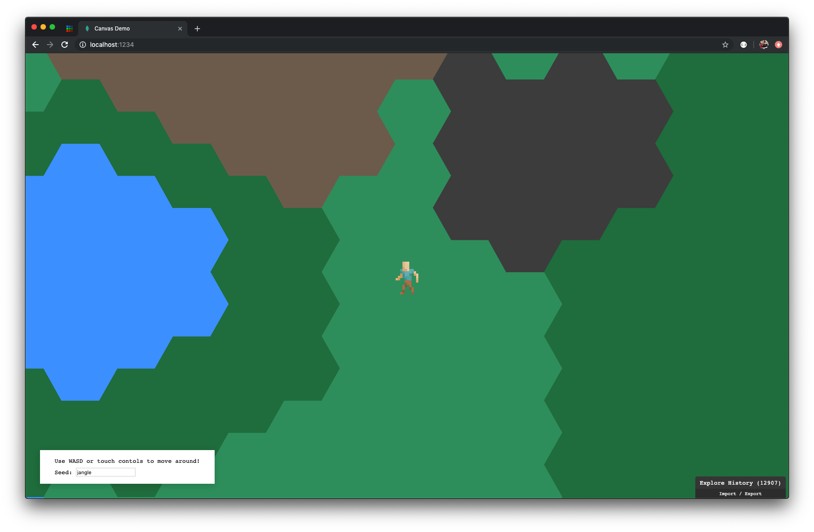

# elm-canvas-things
> tryna see how i can use elm with the canvas api.



## overview

the html5 canvas api isn't built into elm 0.19, which isnt a problem. elm has [ports](https://guide.elm-lang.org/interop/ports.html) for sending messages to javascript.

my experiment was to have elm send over a data structure like this:

```elm
data =
  { size =
    { width = 1920
    , height = 1080
    }
  , background = "#333"
  , items =
      [ rectangle
          { color = "blue"
          , x = 0
          , y = 0
          , width = 50
          , height = 50
          }
      ]
  }
```

as json to some js function like this:

```js
app.ports.outgoing.subscribe(data => {
  canvas.width = data.width
  canvas.height = data.height
  // ... fill with `background` color
  // ... render all `items`
})
```

that way, i could get all the nice, type-safe, elm stuff- but have a bit of js that handles actually calling the canvas api.

it worked out pretty well!

i even got to try out [miniBill/codec](https://package.elm-lang.org/packages/miniBill/elm-codec/latest) for the first time, which was __awesome__! it gave a really nice api for turning my elm data into json.

to see how it performed with updates, i added in some laggy WASD controls for now.

## wanna try it out?

1. `npm install`

1. `npm run dev`